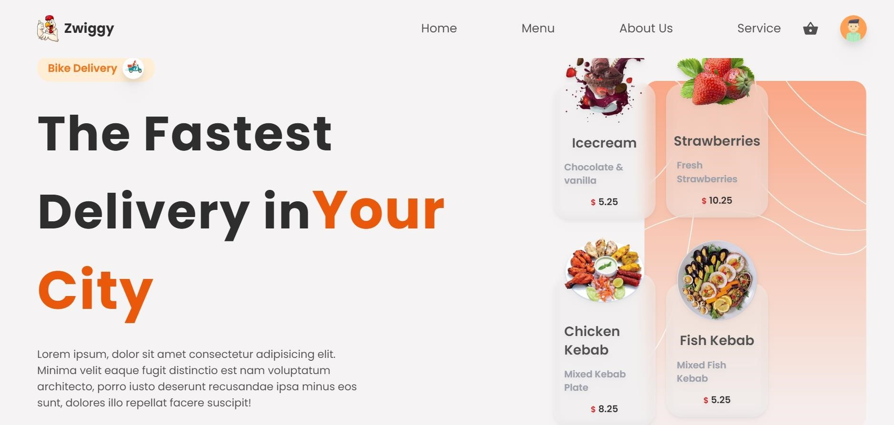

Fullstack Food Delivery Application using Reactjs

• Developed a Full Stack Food Delivery App, featuring an intuitive Admin Dashboard, using React JS,  
Tailwind CSS, Material UI, Node JS Express, and Firebase Cloud Functions. 

• Implemented user authentication with signup and Google authentication for enhanced security. 

• Integrated Stripe Payment Gateway for secure and convenient online payments. 

